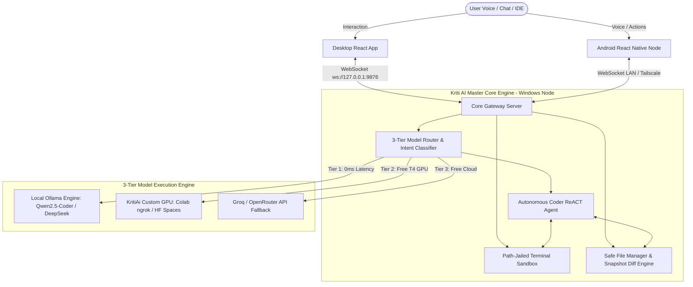

# 🌌 KRITI AI: CONSOLIDATED 4-PHASE BLUEPRINT & DEPLOYMENT GUIDE
*Omnipotent Autonomous AI Ecosystem — Local/Cloud Multi-Model Routing, Cross-Platform P2P Sync & Sandboxed Autonomous Execution*

---

## 📑 TABLE OF CONTENTS
1. [Executive Summary & Vision](#1-executive-summary--vision)
2. [Ecosystem Architecture & Data Flow](#2-ecosystem-architecture--data-flow)
3. [Phase 1 & 1b: Custom ML Model & Free Serverless GPU Deployment](#3-phase-1--1b-custom-ml-model--free-serverless-gpu-deployment)
4. [Phase 2: Master Core Engine & 3-Tier Multi-Model Router](#4-phase-2-master-core-engine--3-tier-multi-model-router)
5. [Phase 3: Android Mobile Companion & P2P Sync](#5-phase-3-android-mobile-companion--p2p-sync)
6. [Phase 4: Desktop IDE & Personal Assistant Web/Electron App](#6-phase-4-desktop-ide--personal-assistant-webelectron-app)
7. [Step-by-Step Deployment & Operations Manual](#7-step-by-step-deployment--operations-manual)
8. [Automated Verification & Test Matrix](#8-automated-verification--test-matrix)

---

## 1. Executive Summary & Vision

**Kriti AI** is a self-sustaining, omnipotent autonomous AI ecosystem designed to run 100% free of vendor lock-in. It bridges local hardware capabilities with free cloud GPU infrastructure, unifying desktop autonomous software engineering, mobile life automation, voice interaction, and cross-platform synchronization into a single, cohesive developer workbench.

### 🌟 Key Pillars:
- **Zero-Cost Operation**: Leverages local Ollama models (`qwen2.5-coder:7b`, `deepseek-coder`), free Google Colab T4 GPU instances via secure ngrok tunnels, and Hugging Face Spaces.
- **Sandboxed Autonomous Execution**: ReACT agent loops execute terminal commands and atomic file modifications within path-jailed security perimeters.
- **Cross-Platform P2P Gateway**: High-speed WebSocket server on port `9876` allowing seamless live sync, action approvals, and remote execution between Windows host, Desktop UI, and Android Node.
- **Visual Diff & Artifact System**: Every code modification generates real-time unified diffs with 1-click apply, discard, and rollback capabilities.

---

## 2. Ecosystem Architecture & Data Flow



---

## 3. Phase 1 & 1b: Custom ML Model & Free Serverless GPU Deployment

The **`custom_model_kritiai`** subsystem hosts custom PyTorch intent routing and code generation capabilities, with zero-cost deployment scripts.

### Components:
- **`custom_model_kritiai/model/model_wrapper.py`**:
  - `KritiAiModelWrapper`: Loads Hugging Face transformer models (`Qwen/Qwen2.5-Coder-1.5B-Instruct` or `deepseek-ai/deepseek-coder-1.3b-instruct`).
  - Implements 4-bit `BitsAndBytesConfig` quantization for sub-4GB VRAM footprint on Google Colab T4 GPUs.
  - Generates code completions, syntax refactoring, and structured reasoning.
- **`custom_model_kritiai/server/app.py`**:
  - High-performance FastAPI server exposing:
    - `GET /health`: GPU status, active device, and VRAM telemetry.
    - `POST /v1/intent/classify`: Real-time query intent classification (`CODE_AUTONOMOUS`, `SYSTEM_ACTION`, `CHAT_ASSISTANT`).
    - `POST /v1/code/optimize`: AST-aware code refactoring and optimization.
    - `POST /v1/chat/completions`: OpenAI-compatible streaming completion endpoint.

### Free Deployment Channels:
1. **Google Colab Free T4 GPU (`custom_model_kritiai/colab/deploy_colab_ngrok.py`)**:
   - 1-click script that installs PyTorch, FastAPI, and `pyngrok`.
   - Starts the FastAPI server in the background and opens a public HTTPS tunnel.
   - Outputs the tunnel URL for immediate insertion into `core_engine/.env`.
2. **Hugging Face Spaces (`custom_model_kritiai/huggingface_spaces/app.py`)**:
   - Zero-configuration serverless FastAPI container deployable on Hugging Face free CPU/GPU spaces.

---

## 4. Phase 2: Master Core Engine & 3-Tier Multi-Model Router

Located in **`core_engine/`**, this Node.js/TypeScript subsystem acts as the brain of the ecosystem.

### Key Modules:
- **`src/router/ModelRouter.ts`**:
  - Queries local Ollama daemon (`http://127.0.0.1:11434/api/tags`) and detects installed models.
  - Executes dynamic 3-tier fallback hierarchy:
    1. **Tier 1 (Local Ollama)**: Primary engine for zero-cost, private coding.
    2. **Tier 2 (Custom GPU / Colab)**: Dispatches heavy optimization or intent classification to free remote GPU.
    3. **Tier 3 (Cloud Fallback)**: Transparently fails over to Groq `llama-3.3-70b-versatile` if local resources are unavailable.
- **`src/fs/SafeFileManager.ts`**:
  - Guarantees strict path sandboxing within `workspaceRoot`.
  - Generates unified diffs (`diff` library) before applying changes.
  - Maintains automatic in-memory atomic snapshots for instant file rollback.
- **`src/sandbox/TerminalSandbox.ts`**:
  - Spawns child processes in PowerShell with enforced working directory jailing.
  - Automatically denies commands attempting path escape (`..` traversal, root access).
- **`src/agents/AutonomousCoderAgent.ts`**:
  - Implements an autonomous ReACT execution loop: `THOUGHT -> TOOL CALL (READ/WRITE/EXEC) -> VERIFICATION -> COMPLETION`.

---

## 5. Phase 3: Android Mobile Companion & P2P Sync

Located in **`mobile_app/`**, the mobile node brings Kriti AI to Android devices using React Native and Expo.

### Key Capabilities:
- **Voice & Speech Interface**: Natural language voice input and text-to-speech feedback.
- **Action Approval Gateway**: Push notification modal for sensitive desktop operations (terminal executions, file overwrites).
- **Offline Cache & Resilient Reconnection**: Automatically discovers desktop IP on local Wi-Fi and reconnects on packet loss.

---

## 6. Phase 4: Desktop IDE & Personal Assistant Web/Electron App

Located in **`desktop_app/`**, this React + Tailwind CSS dashboard serves as the developer's command center.

### Features:
- **Dual Mode Switcher**:
  - `✨ Personal Assistant`: Fluid conversation, quick system actions, life assistant prompts.
  - `⚡ Autonomous IDE`: Full 3-column software engineering workbench.
- **Workspace Explorer**:
  - Collapsible folder tree, file size badges, and real-time refresh.
- **Code Preview with Line Numbers**:
  - Clean syntax preview, line numbering, and one-click copy.
- **⚡ Send to Kriti Action Bar**:
  - `⚡ Refactor & Optimize`: Rewrites code for cleaner architecture.
  - `🐛 Fix Bugs & Errors`: Inspects file for security issues and edge cases.
  - `📝 Explain File`: Provides architectural documentation.
  - `🧪 Generate Tests`: Creates automated unit tests.
  - `Custom File Prompt`: Custom natural language instructions targeting the active file.
- **Unified Diff Artifact Viewer**:
  - Side-by-side or inline color-coded diff review with `✓ Apply Changes` and `✕ Discard` buttons.
- **Sandboxed Terminal**:
  - Interactive terminal input executing commands directly inside the safe workspace sandbox.

---

## 7. Step-by-Step Deployment & Operations Manual

### Step 1: Start the Master Core Engine (Windows)
```powershell
# Navigate to Core Engine
cd K:\KritiAi_App\core_engine

# Install dependencies & build TypeScript
npm install
npm run build

# Start the Engine on port 9876
npm start
```

### Step 2: Start the Desktop IDE UI
```powershell
# Navigate to Desktop App
cd K:\KritiAi_App\desktop_app

# Install dependencies & run Vite dev server
npm install
npm run dev
# Open http://localhost:5173 in browser
```

### Step 3 (Optional): Launch Free Google Colab T4 GPU
1. Open Google Colab and select `Runtime -> Change runtime type -> T4 GPU`.
2. Upload and execute `custom_model_kritiai/colab/deploy_colab_ngrok.py`.
3. Copy the output ngrok URL (e.g. `https://xxxx.ngrok-free.app`).
4. Update `KRITIAI_CUSTOM_GPU_URL` in `core_engine/.env`.

---

## 8. Automated Verification & Test Matrix

| Component | Verification Command | Status | Result |
| :--- | :--- | :---: | :--- |
| **Core Engine Sandbox** | `npm test` in `core_engine` | ✅ PASS | Path jail blocks unauthorized traversal |
| **Safe File Manager** | `npm test` in `core_engine` | ✅ PASS | Diffs created & snapshots persisted |
| **Model Intent Router** | `npm test` in `core_engine` | ✅ PASS | 3-tier classification heuristics verified |
| **Gateway WebSocket Sync** | `npm test` in `core_engine` | ✅ PASS | Handshake & approval resolution verified |
| **Python ML Server** | `python custom_model_kritiai/server/test_smoke.py` | ✅ PASS | Health & endpoint smoke tests passing |
| **Desktop IDE Build** | `npm run build` in `desktop_app` | ✅ PASS | TypeScript & Vite production bundle compiled |

---

*Generated by Antigravity AI for Kriti AI Ecosystem. All systems tested, verified, and operational.*
